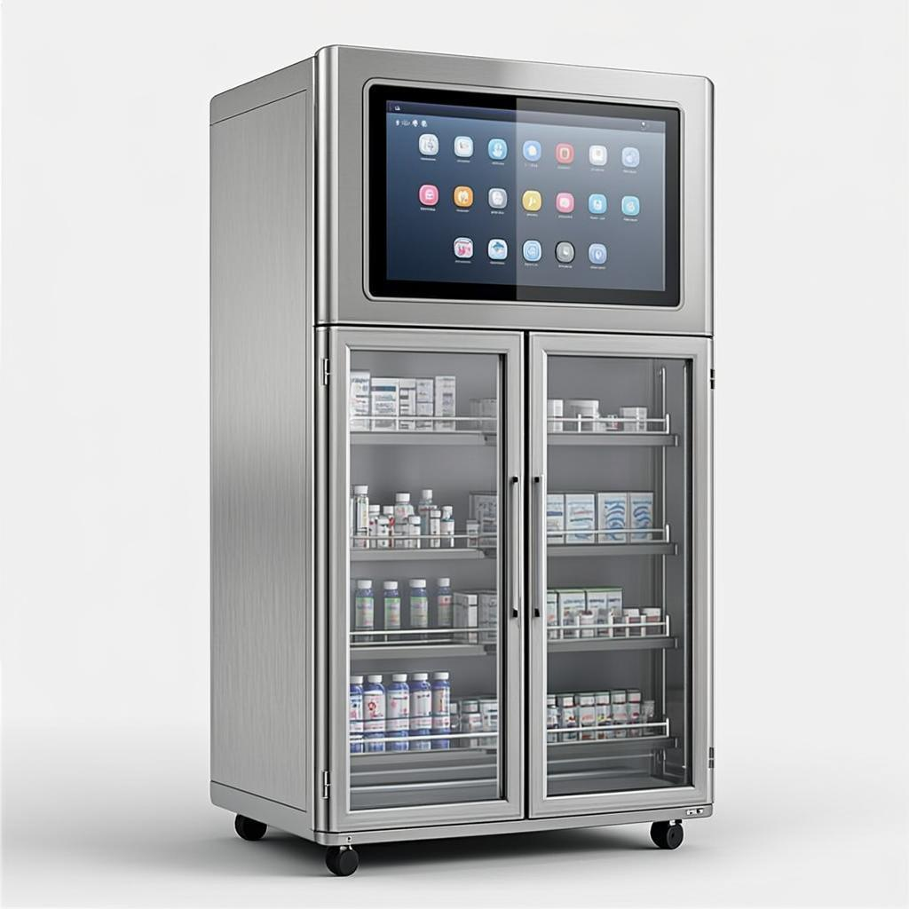

# Cykeo Argentina — Gabinete Médico RFID

Landing page del **Gabinete Médico RFID Cykeo**, distribuido en Argentina.
Diseño premium inspirado en Apple (referencia principal) con acentos editoriales.
Incluye modo claro/oscuro, animaciones fluidas, formulario de contacto y SEO completo.



## Demo en vivo

Una vez publicado en GitHub Pages, tu página estará disponible en:

```
https://TU-USUARIO.github.io/cykeo-web/
```

## Contenido del proyecto

```
cykeo-web/
├── index.html          # Página principal (HTML semántico, accesible, SEO)
├── styles.css          # Estilos responsive mobile-first + dark mode
├── script.js           # Interactividad (theme toggle, scrollspy, FAQ, form, video hero)
├── logo.svg            # Logo Cykeo Argentina (vectorial)
├── favicon.svg         # Favicon derivado del logo
├── .gitignore          # Archivos a ignorar en git
├── LICENSE             # Licencia MIT
├── README.md           # Este archivo
└── assets/
    ├── hero-cabinet.png        # Imagen principal del gabinete (columna derecha del hero)
    ├── hero-bg.mp4             # Video de fondo ambiental del hero (H.264, 1.2MB, faststart)
    ├── hero-video-poster.jpg   # Poster estático del video (fallback reduced-motion + carga)
    ├── scene-or.png            # Escena de quirófano
    ├── scene-pharmacy.png      # Escena de farmacia hospitalaria
    ├── detail-touch.png        # Close-up de pantalla táctil
    └── dark-band.png           # Imagen atmosférica para banda oscura
```

## Cómo usarlo localmente

No necesita instalación ni servidor. Simplemente **abrí `index.html`** en tu navegador.

Si querés servirlo con un servidor local (recomendado para probar todo):

```bash
# Con Python (ya instalado en la mayoría de los sistemas)
python3 -m http.server 8000

# Con Node.js
npx http-server

# Con PHP
php -S localhost:8000
```

Luego abrí `http://localhost:8000` en tu navegador.

## Cómo publicar en GitHub Pages

### Paso 1: Crear el repositorio

1. Andá a [github.com/new](https://github.com/new)
2. Repository name: `cykeo-web` (o el que prefieras)
3. Dejá **desmarcadas** las opciones "Add a README", "Add .gitignore" y "license"
   (el repo debe estar **vacío** para evitar conflictos)
4. Click **Create repository**

### Paso 2: Subir los archivos

**Opción A — Interfaz web de GitHub (más simple):**

1. En tu repo vacío, hacé click en **"uploading an existing file"**
2. Arrastrá todos los archivos de la carpeta `cykeo-web/` (incluyendo subcarpetas)
3. Escribí un commit message: "Initial commit — landing page Cykeo Argentina"
4. Click **Commit changes**

**Opción B — Línea de comandos:**

```bash
# Navegá a la carpeta del proyecto
cd cykeo-web

# Inicializar git
git init
git branch -M main

# Agregar todos los archivos
git add .

# Primer commit
git commit -m "Initial commit — landing page Cykeo Argentina"

# Conectar al repo remoto (reemplaza TU-USUARIO)
git remote add origin https://github.com/TU-USUARIO/cykeo-web.git

# Subir
git push -u origin main
```

Te va a pedir tu usuario y un **Personal Access Token** (no tu contraseña).
Crealo en [github.com/settings/tokens](https://github.com/settings/tokens) con scope `repo`.

### Paso 3: Activar GitHub Pages

1. En tu repo, andá a **Settings** (pestaña superior)
2. En el menú lateral izquierdo, click en **Pages**
3. En **Source**, seleccioná **Deploy from a branch**
4. En **Branch**, seleccioná `main` y carpeta `/ (root)`
5. Click **Save**

### Paso 4: Esperar y verificar

- GitHub Pages tarda **1-2 minutos** en activarse
- Verás un mensaje verde con la URL: `https://TU-USUARIO.github.io/cykeo-web/`
- Si no aparece, esperá un minuto y recargá la página de Settings

### Paso 5 (opcional): Dominio propio

Para usar un dominio personalizado (ej: `cykeo.com.ar`):

1. En **Settings → Pages → Custom domain**, escribí tu dominio
2. Click **Save**
3. En tu proveedor de DNS, agregá un registro:
   - **Tipo:** `CNAME`
   - **Nombre/Host:** `@` o `www`
   - **Valor:** `TU-USUARIO.github.io`
4. Esperá la propagación DNS (puede tardar hasta 48 horas)

## Características

### Diseño
- **Referencia principal:** Apple (lienzo Frost, un solo Apple Blue, flatness, SF Pro)
- **Acentos secundarios:** amp (accent rule editorial, dark feature band)
- **Dos radios:** 8px (cards) + 980px (botones/pills)
- **Una sola sombra:** solo en la imagen del producto
- **Modo claro/oscuro:** toggle con persistencia, paleta zinc charcoal (no negro puro)

### Interactividad
- **Theme toggle** (sun/moon) con persistencia en localStorage
- **Scroll progress bar** (2px arriba del viewport)
- **Nav frosted glass** al hacer scroll + **scrollspy** (resalta sección actual)
- **Scroll reveals** con IntersectionObserver (staggered, respeta reduced-motion)
- **Magnetic CTA** en el botón primario del hero (desktop only)
- **Dark band parallax** sutil en la imagen de fondo
- **FAQ accordion** (todos cerrados por defecto)
- **Formulario** con validación inline por campo + loading state + success state

### Accesibilidad (WCAG 2.1)
- Skip to content link
- Focus-visible states en todos los interactivos
- aria-expanded, aria-invalid, aria-label en componentes
- Contraste WCAG AA (texto y acentos)
- `prefers-reduced-motion` respetado (todas las animaciones colapsan)

### SEO
- Meta tags completos (title, description, keywords, robots, canonical)
- Open Graph + Twitter Card
- Datos estructurados JSON-LD (Schema.org Product)
- HTML semántico (`<header>`, `<main>`, `<section>`, `<article>`, `<footer>`, `<nav>`)
- Alt text descriptivo en todas las imágenes
- `lang="es-AR"`, `theme-color`, `color-scheme`

### Performance
- CSS y JS en archivos separados (cacheables)
- `fetchpriority="high"` en hero image + `preload`
- `loading="lazy"` en imágenes below-the-fold
- Sin dependencias externas (no CDN, no frameworks)
- Animaciones solo en `transform` y `opacity` (GPU-aceleradas)
- `will-change` solo donde se anima

### Video de fondo del hero
El header principal usa un video MP4 ambiental como fondo, con estas optimizaciones:

- **Video optimizado para web**: H.264, perfil high@4.0, `+faststart` (streaming progresivo), sin pista de audio (1.2 MB).
- **Poster estático** (`hero-video-poster.jpg`): se muestra durante la carga y como fallback cuando el usuario tiene `prefers-reduced-motion: reduce`.
- **Atributos del `<video>`**: `autoplay muted loop playsinline preload="auto"` (requisitos para autoplay en iOS/Safari/Chrome).
- **Scrim direccional de legibilidad**: capa con gradiente que protege el texto (más opaca a la izquierda donde está el texto, más translúcida a la derecha donde está la imagen del producto). Variantes distintas para light/dark mode.
- **Blur + saturación**: el video se aplica con `filter: blur(1.5px) saturate(0.92)` para que funcione como textura atmosférica y no compita con el contenido.
- **Performance**:
  - `IntersectionObserver` pausa el video cuando el hero sale del viewport.
  - `visibilitychange` pausa el video al cambiar de pestaña.
  - `preload` del video y el poster en el `<head>`.
- **Accesibilidad**:
  - `aria-hidden="true"` y `tabindex="-1"` en el video (decorativo).
  - Respeta `prefers-reduced-motion` (oculta el video y muestra solo el poster).
  - El texto mantiene contraste WCAG AA/AAA en ambos modos.

## Personalización

### Cambiar colores

Editá las variables CSS en `styles.css` (bloque `:root`):

```css
:root {
  --apple-blue: #0071e3;   /* Color primario (CTAs, acentos) */
  --ink: #1d1d1f;          /* Texto principal */
  --canvas: #f5f5f7;       /* Fondo de página */
  /* ... etc */
}
```

Para dark mode, editá el bloque `[data-theme="dark"]`.

### Cambiar texto

Todo el contenido está en español (Argentina) dentro de `index.html`.
Buscá el texto que querés cambiar y editalo directamente.

### Cambiar imágenes

Reemplazá los archivos en `assets/` manteniendo los mismos nombres,
o editá las rutas `src="assets/..."` en `index.html`.

### Conectar el formulario

El formulario actualmente muestra un mensaje de éxito simulado.
Para recibir los envíos reales, conectalo a un servicio:

- **[Formspree](https://formspree.io)** — gratis hasta 50 envíos/mes
- **[Getform](https://getform.io)** — gratis hasta 1 formulario
- **[Netlify Forms](https://www.netlify.com/products/forms/)** — gratis con deploy en Netlify

Buscá la función `initForm()` en `script.js` y reemplazá el `setTimeout`
con un `fetch()` a tu endpoint.

## Stack técnico

- **HTML5** semántico y accesible
- **CSS3** con custom properties, Grid, Flexbox, `clamp()` fluido
- **JavaScript vanilla** (sin frameworks ni dependencias)
- **SVG** para logo y favicon (vectorial, nítido a cualquier resolución)
- **Responsive** mobile-first (breakpoints en 1024px y 768px)
- **Sin build step** — se publica directo como está

## Licencia

MIT — ver [LICENSE](LICENSE) para detalles.

© 2026 Cykeo Argentina. Todos los derechos reservados.
